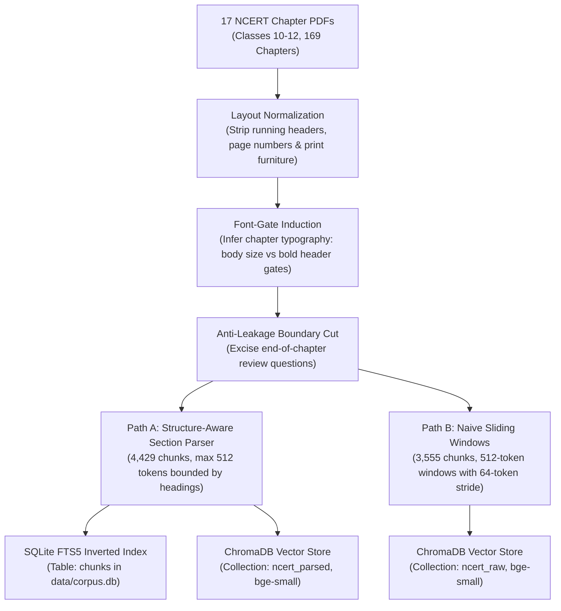
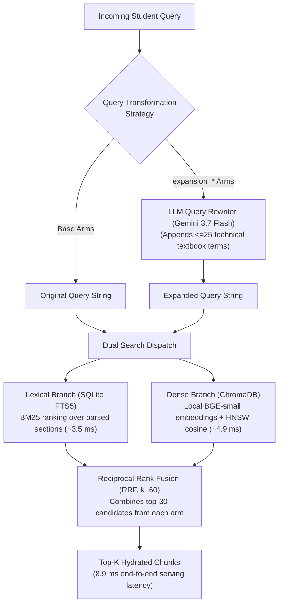
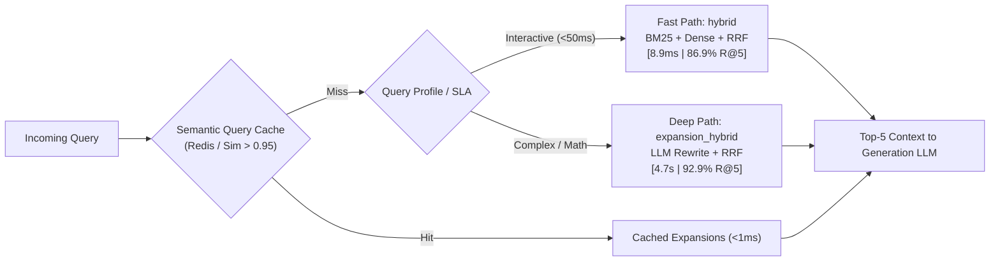

# ncert-rag: Empirical Retrieval Benchmark for Technical Domains

[](https://www.python.org/)
[](https://docs.astral.sh/uv/)
[](https://www.sqlite.org/fts5.html)
[](https://www.trychroma.com/)
[](https://huggingface.co/BAAI/bge-small-en-v1.5)
[](tests/)
[](https://github.com/astral-sh/ruff)

An empirical retrieval evaluation harness built over 17 NCERT science and mathematics textbooks (classes 10–12, 169 chapters). Designed to answer a fundamental production search question with statistical rigor rather than intuition:

> **What retrieval architecture actually serves technical student queries, and what does it cost in latency and compute?**

Rather than treating RAG as an arbitrary assembly of framework components, this repository runs a controlled ablation across **eight retrieval strategies** over an identical corpus, evaluating them against **282 real exercise questions** across accuracy, latency, and paired statistical significance.

---

## The Bottom Line

| Tier | Technique | R@5 | Median Latency | Production Verdict |
| :--- | :--- | :--- | :--- | :--- |
| **Best Accuracy** | `expansion_hybrid` | **92.9%** | ~4,709 ms | High accuracy, but incurs a ~500× latency penalty and recurring LLM costs. |
| **Recommended (Pareto Sweet Spot)** | `hybrid` | **86.9%** | **8.9 ms** | Zero model at query time, sub-10ms latency, runs entirely on CPU. |
| **Baseline** | `bm25` | 75.5% | 3.5 ms | Fast, but struggles when student phrasing differs from textbook vocabulary. |

**The Core Finding:** Fusing lexical search (`bm25`) with dense embeddings (`bge-small`) via Reciprocal Rank Fusion reaches **~87% R@5 at 8.9 milliseconds** with zero runtime model dependencies. Placing an LLM query rewriter on the critical path buys an additional **6.0 points of recall (p=0.0021)**, but inflates serving latency from single-digit milliseconds to **4.7 seconds**.

---

## Architecture & Data Flow

The system is split into two clean pipelines: an offline layout-aware ingestion and dual-indexing pipeline, and a sub-10ms query-time hybrid serving engine.

### 1. Offline Ingestion & Dual Indexing Pipeline



* **Layout Normalization:** Removes running headers, page edges, and publisher metadata without mangling paragraph continuity.
* **Font-Gate Induction:** Discovers typography scales dynamically per book (`HeadingProfile`) rather than using brittle hardcoded font size rules.
* **Anti-Leakage Cut:** Drops exercise pages before indexing to prevent ground-truth contamination.
* **Dual Indexing Paths:** Generates two distinct chunk collections (`ncert_parsed` vs `ncert_raw`) to enable rigorous controlled ablations of document structure parsing.

### 2. Query-Time Hybrid Serving Engine



* **Lexical Branch:** Executes tokenized BM25 search over SQLite FTS5 in single-digit milliseconds.
* **Dense Branch:** L2-normalizes queries with local `bge-small-en-v1.5` embeddings on CPU and queries Chroma HNSW index.
* **Reciprocal Rank Fusion:** Combines scores using $RRF(d) = \sum \frac{1}{60 + r_m(d)}$, bypassing fragile cross-modal score calibration.
* **Optional Expansion Path:** Allows higher-accuracy query rewrites when sub-10ms SLAs are relaxed.

---

## Quick Start

Requires [uv](https://docs.astral.sh/uv/) and Python 3.14+.

```bash
# 1. Clone & install dependencies
git clone https://github.com/amanverma-765/ncert-rag-evals.git
cd ncert-rag-evals
uv sync

# 2. Ingest, parse, and index all 17 textbooks (~10 mins on CPU, fully idempotent)
uv run ncert-rag build

# 3. Query the index across any retrieval arm
uv run ncert-rag search "why do we feel tired after running fast" --arm hybrid
```

---

## The Eight Retrieval Techniques

The eight arms systematically isolate three design variables: **lexical vs dense**, **structural AST parsing vs sliding windows**, and **zero-model serving vs LLM query expansion**.

| Arm | Description | What Variable It Isolates |
| :--- | :--- | :--- |
| `bm25` | Keyword search via SQLite FTS5 over section-aware chunks using Porter stemming. | Lexical baseline. |
| `vector_parsed` | Dense semantic search (cosine similarity via `bge-small-en-v1.5`) over structure-aware section chunks bounded by textbook heading hierarchies. | Dense semantic retrieval over parsed document structure. |
| `vector_raw` | Dense semantic search using the same embedding model over blind, fixed-size 512-token sliding windows (64-token overlap) cut with zero document structure parsing. | **Directly isolates the marginal value of AST section chunking.** |
| `hybrid` | Reciprocal Rank Fusion (RRF, $k=60$) combining `bm25` and `vector_parsed` at depth 30. | **Lexical + dense rank fusion.** |
| `expansion_bm25` | LLM rewrites the query into technical textbook vocabulary $\rightarrow$ `bm25`. | Lexical with query expansion. |
| `expansion_vector` | Same LLM rewrite $\rightarrow$ `vector_parsed`. | Dense with query expansion. |
| `expansion_raw` | Same LLM rewrite $\rightarrow$ `vector_raw`. | Blind windows with query expansion. |
| `expansion_hybrid` | Same LLM rewrite $\rightarrow$ `hybrid`. | **Upper bound: fusion + query expansion.** |

---

## Full Evaluation Results

Evaluated over **282 ground-truth questions** derived from end-of-chapter exercises and paraphrased to simulate natural student inquiries. CI automated tests verify that numbers in this table exactly match the generated benchmark artifact in [`evals/REPORT.md`](evals/REPORT.md).

| Arm | R@1 | R@5 | R@10 | MRR | n |
|---|---|---|---|---|---|
| bm25 | 53.9% | 75.5% | 81.9% | 0.635 | 282 |
| vector_parsed | 59.6% | 83.3% | 90.8% | 0.698 | 282 |
| vector_raw | 58.9% | 84.4% | 89.7% | 0.693 | 282 |
| hybrid | 58.5% | 86.9% | 92.9% | 0.704 | 282 |
| expansion_bm25 | 71.6% | 90.8% | 94.3% | 0.802 | 282 |
| expansion_vector | 71.3% | 90.8% | 94.3% | 0.800 | 282 |
| expansion_raw | 69.9% | 92.2% | 95.0% | 0.789 | 282 |
| expansion_hybrid | 72.7% | 92.9% | 95.0% | 0.815 | 282 |

---

### The Two Text Tiers

PDF extraction quality varies dramatically across STEM textbooks. Aggregating results across the entire corpus hides critical domain failure modes. We split the evaluation into two distinct tiers:

* **`clean` (13 non-mathematics books, n=239):** Biology, Chemistry, Computer Science, and Economics. Text extracts as continuous, legible prose.
* **`fragmented` (4 mathematics books, n=43):** Mathematics textbooks where formulas, fractions, radicals, and exponents are shredded by PDF extractors into isolated 1- or 2-character tokens.

| Tier | bm25 | hybrid | expansion_hybrid | n |
|---|---|---|---|---|
| clean | 74.9% | 87.0% | 92.9% | 239 |
| fragmented | 79.1% | 86.0% | 93.0% | 43 |

*Note on statistical power:* At $n=43$ in the fragmented tier, a single question shifts the score by 2.3 percentage points. Interpret the math tier as a directional signal rather than a high-precision metric.

---

### Which Differences are Real? (Paired Significance Testing)

Because every retrieval arm answers the exact same 282 test queries, evaluating performance deltas using independent-sample tests or naive margins is statistically invalid. We perform **McNemar's test** on discordant pairs (queries where Technique A and Technique B disagree):

$$\chi^2 = \frac{(|\text{wins}_B - \text{wins}_A| - 1)^2}{\text{wins}_A + \text{wins}_B}$$

| Comparison | Shift at R@5 | Net Gap | Discordant (B/A) | p-value | 95% CI | Verdict |
| :--- | :--- | :--- | :--- | :--- | :--- | :--- |
| `hybrid` over `bm25` | 75.5% $\rightarrow$ 86.9% | +11.3 | 35 / 3 | <0.0001 | [+7.3, +15.4] | **Established** |
| `vector_parsed` over `bm25` | 75.5% $\rightarrow$ 83.3% | +7.8 | 42 / 20 | 0.0077 | [+2.4, +13.2] | **Established** |
| `expansion_hybrid` over `hybrid` | 86.9% $\rightarrow$ 92.9% | +6.0 | 22 / 5 | 0.0021 | [+2.5, +9.6] | **Established** |
| `hybrid` over `vector_parsed` | 83.3% $\rightarrow$ 86.9% | +3.5 | 22 / 12 | 0.1227 | [-0.5, +7.6] | Undecided |
| `vector_parsed` over `vector_raw` | 84.4% $\rightarrow$ 83.3% | -1.1 | 12 / 15 | 0.7003 | [-4.7, +2.5] | **Undecided (Negative Result)** |

*Five pre-specified tests sharing no multiple-comparison correction (Bonferroni threshold $p < 0.01$). A high p-value indicates the dataset cannot distinguish the arms, not that they are identical.*

---

## Serving Cost & Latency Analysis

Benchmarked serially over an 80-question sample on CPU (AMD Ryzen / Linux) to measure single-user latency rather than pooled throughput:

| Arm | R@5 | Median Latency | Query Model Cost | Critical Path Overhead |
| :--- | :--- | :--- | :--- | :--- |
| `bm25` | 80.0% | 3.5 ms | $0.00 | SQLite FTS5 index scan |
| `vector_raw` | 83.8% | 4.8 ms | $0.00 | Local BGE embedding + Chroma HNSW (sliding windows) |
| `vector_parsed` | 85.0% | 4.9 ms | $0.00 | Local BGE embedding + Chroma HNSW (section chunks) |
| `hybrid` | 88.8% | **8.9 ms** | **$0.00** | FTS5 + BGE embedding + RRF fusion |
| `expansion_bm25` | 90.0% | 4,563.4 ms | ~$0.0002 | External LLM rewrite round-trip |
| `expansion_vector` | 93.8% | 4,625.3 ms | ~$0.0002 | External LLM rewrite round-trip |
| `expansion_raw` | 93.8% | 4,585.2 ms | ~$0.0002 | External LLM rewrite round-trip |
| `expansion_hybrid` | 96.2% | **4,708.8 ms** | **~$0.0002** | External LLM rewrite + Hybrid retrieval |

### Key Production Trade-offs
1. **The Sub-10ms Production Champion:** `hybrid` achieves 86.9% R@5 at 8.9 ms with zero external network dependencies and zero token costs. For real-time conversational agents, this is the optimal operational configuration.
2. **The Latency Wall:** Adding an LLM query rewrite increases latency by **~528×** (~4.7 seconds). While it provides the highest overall recall (92.9%), running it synchronously on every query damages user experience and multiplies serving cost.
3. **The Caching Strategy:** Student queries exhibit significant semantic clustering. Deploying `expansion_hybrid` behind a semantic query cache allows high recall on popular questions while falling back to `hybrid` when low-latency SLAs are enforced.



---

## Key Engineering Discoveries & Pitfalls

### 1. The Exercise Data Leak (Contamination Trap)
NCERT textbooks print end-of-chapter exercise questions directly on the final pages of each chapter. Because our evaluation queries originate from these exercises, naive PDF ingestion indexed these exercise pages into SQLite and Chroma.
* **The Symptom:** BM25 Recall@1 artificially skyrocketed into the 90s, completely masking dense retrieval benefits. The search engine wasn't retrieving explanatory passages; it was matching the literal question text printed on the exercise page.
* **The Fix:** We implemented a heuristic exercise boundary detector (`ncert_rag/ingest/pdf/parser.py`) that identifies the start of the exercise block via typography and regex triggers, dropping those pages from both the raw and parsed chunk indexes before embedding.

### 2. The Structural Parser Negative Result
Industry conventional wisdom asserts that document-structure-aware chunking (parsing headers, subheadings, and section hierarchies) dramatically outperforms naive sliding windows.
* **The Empirical Reality:** `vector_parsed` (structure-aware section chunks) scored **83.3% R@5**, while `vector_raw` (blind 512-token sliding windows with 64-token overlap) scored **84.4% R@5**—a 1.1-point advantage for naive sliding windows ($p=0.7003$, 95% CI [-4.7, +2.5]).
* **Why did the parser fail to improve recall?**
  1. *Boundary Truncation:* Strict section parsing often produces short chunks (<100 tokens) that lack sufficient dense semantic context for the embedding model.
  2. *Window Bridging:* A 64-token overlap across sliding windows naturally bridges semantic boundaries without parser overhead.
  3. *Takeaway:* Section parsing remains valuable for UI citation boundaries and reading comprehension, but should not be assumed to enhance retrieval recall.

### 3. Self-Grading Rewriter Bias
When evaluating query expansion, if the LLM used to generate synthetic test queries belongs to the same model family as the query rewriter, the expansion arm gains an artificial **~11-point advantage** by predicting its own vocabulary. We explicitly decoupled our evaluation stack: test queries were generated via `claude-sonnet-4-6`, while query expansion runs via `gemini-3.7-flash-medium`.

### 4. Storage Consistency & SQLite ID Recycling
In SQLite, deleting records and inserting new ones can reuse row IDs. If Chroma vectors are updated after SQLite tables are modified, outdated embeddings can point to new chapters. Our rebuild pipeline enforces strict synchronization: book vector collections are wiped from Chroma **before** chunk records are deleted in SQLite.

---

## Repository Structure & Engineering Standards

The codebase adheres strictly to Separation of Concerns (SoC) and clean layered architecture:

```text
ncert-rag-evals/
├── src/ncert_rag/
│   ├── core/           # Domain entities (Pydantic v2 models, BookSpec, Registry)
│   ├── ingest/
│   │   ├── pdf/        # PDF extraction, font-gate induction, layout analysis
│   │   └── text/       # Text cleaning, normalizers, token-based chunking
│   ├── store/          # Storage engines: SQLite FTS5 schema & Chroma collections
│   ├── retrieve/       # Retrieval protocol and arms (BM25, Vector, Hybrid RRF, Expansion)
│   ├── services/       # Embedder (BAAI/bge-small) and Chat completions client
│   └── cli.py          # CLI entry points (build, search)
├── evals/
│   ├── questions.py    # Query generation & ground truth formulation
│   ├── metrics.py      # Recall@k, MRR, McNemar significance, Wilson CIs
│   ├── run.py          # Benchmark runner (generates evals/REPORT.md)
│   ├── cost.py         # Serial latency profiler
│   ├── EVALUATION.md   # Comprehensive technical evaluation whitepaper
│   └── REPORT.md       # Generated benchmark artifact
└── tests/              # 92 unit and integration tests (including doc-match guards)
```

Dependencies flow strictly in one direction: `core` $\leftarrow$ `ingest` $\rightarrow$ `store` $\leftarrow$ `retrieve` $\leftarrow$ `evals`.

---

## Reproducing the Evaluation

The 282 ground-truth queries are pre-generated and checked into `evals/questions.json`.

### Model-Free Arms (Offline, Zero LLM API Keys Required)
You can evaluate the four model-free arms (`bm25`, `vector`, `vector_raw`, `hybrid`) completely offline:

```bash
uv run python -m evals.run --arms bm25,vector,vector_raw,hybrid --force
```

### Full Evaluation Suite (Including LLM Query Expansion)
To run the full suite including `expansion_*` arms:
1. Ensure your LLM proxy or API endpoint is configured in `.env` (`NINEROUTER_API_KEY` or custom provider).
2. Execute the benchmark runner:

```bash
# 1. Run accuracy benchmark across all 8 arms -> updates evals/REPORT.md
uv run python -m evals.run

# 2. Run latency benchmark -> appends serving cost to evals/REPORT.md
uv run python -m evals.cost -n 80

# 3. Execute the full test suite
uv run pytest

# 4. Verify code quality & formatting
uv run ruff check .
uv run ruff format --check .
```

*CI Guard Notice:* `tests/test_docs_match_report.py` executes during `pytest` and asserts that all tables and metrics in `README.md` and `evals/EVALUATION.md` match `evals/REPORT.md` verbatim. If benchmark numbers drift, the test suite fails.
