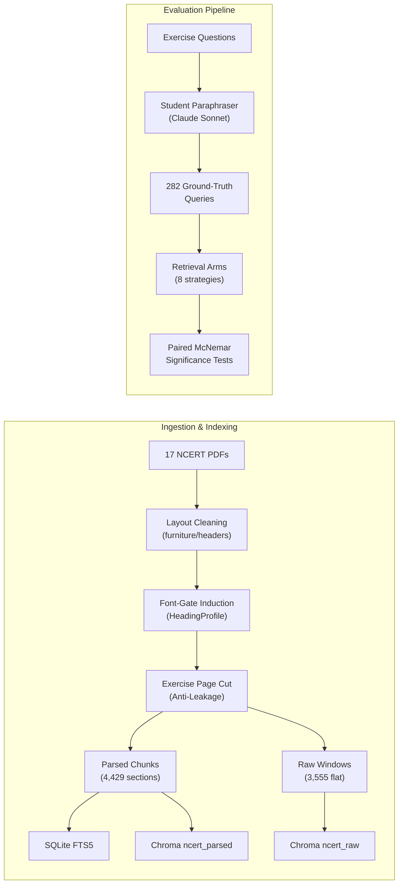
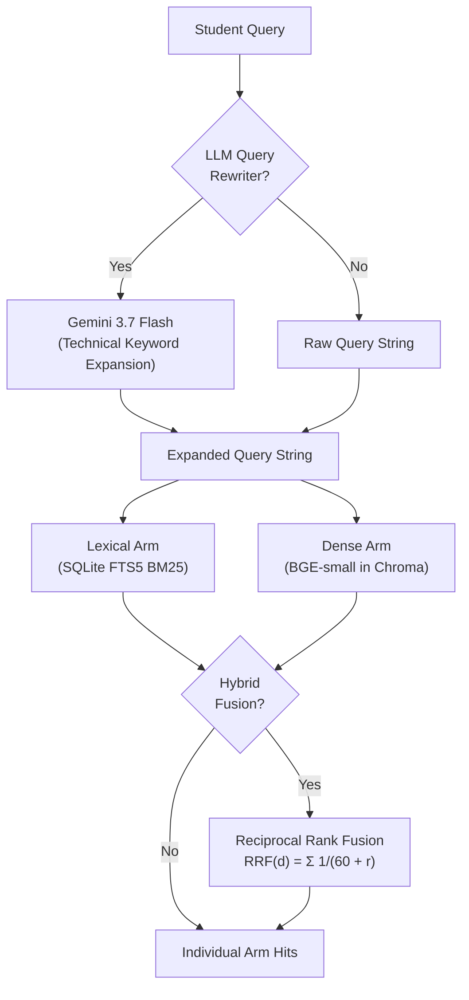
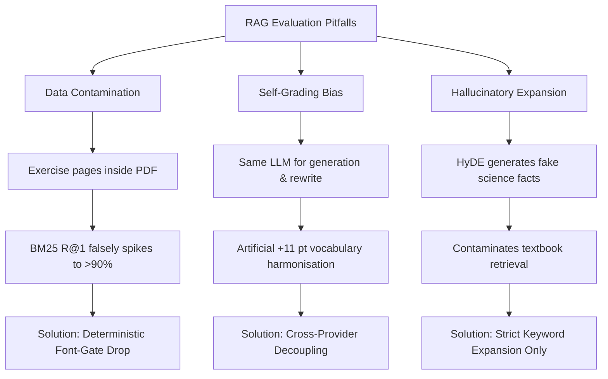
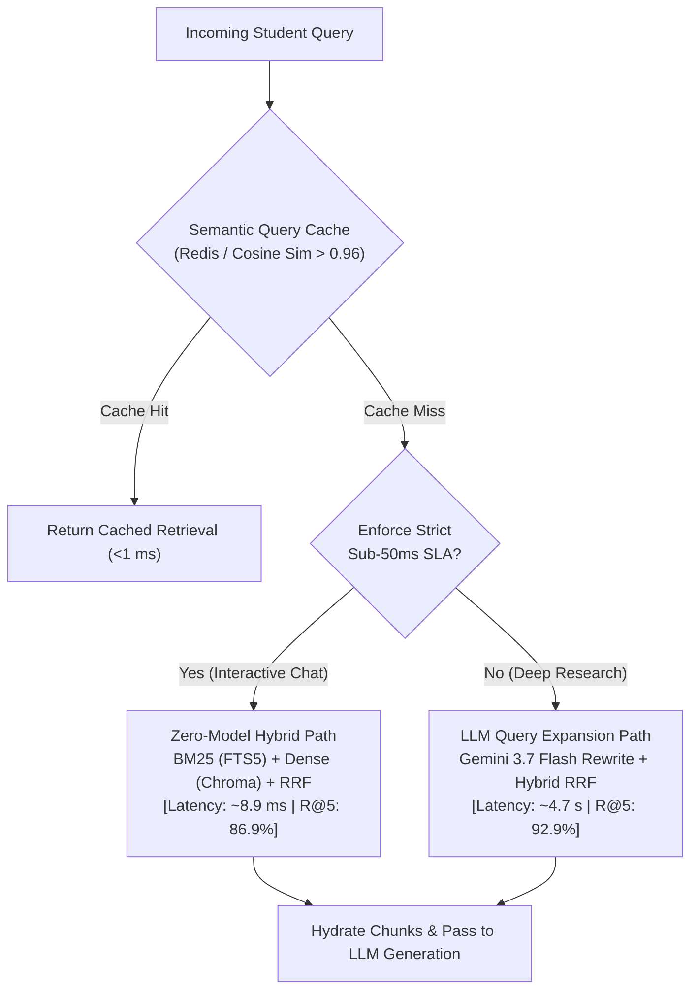

# NCERT Retrieval Evaluation: Systems Whitepaper & Empirical Benchmark

An empirical investigation into retrieval-augmented generation (RAG) architectures across 17 NCERT science and mathematics textbooks (classes 10–12, 169 chapters, 4,429 chunks), measured against 282 synthetic student queries.

---

## 1. Executive Summary & The Bottom Line

When architecting retrieval systems for specialized technical domains, engineering teams frequently reach for complex solutions—multi-stage LLM query rewriting, recursive document tree parsers, and multi-vector representations—without measuring their marginal contribution over simpler baselines.

This report evaluates eight distinct retrieval techniques over a unified, real-world educational corpus to answer a core systems question:

> **What retrieval architecture delivers the highest recall for student queries, and what is its true cost in latency, compute, and complexity?**

### Headline Findings

| Configuration | R@5 | Median Latency | Query Compute | Operational Complexity | Production Recommendation |
| :--- | :--- | :--- | :--- | :--- | :--- |
| **Best Accuracy** (`expansion_hybrid`) | **92.9%** | ~4,709 ms | External LLM call (Gemini) | High (Network I/O, API quotas, failure modes) | Reserved for complex queries or behind a semantic cache. |
| **Pareto Optimal** (`hybrid`) | **86.9%** | **8.9 ms** | Local CPU (FTS5 + BGE embedding) | Minimal (Embedded SQLite + Chroma) | **Recommended default for interactive production systems.** |
| **Lexical Baseline** (`bm25`) | 75.5% | 3.5 ms | Local CPU (SQLite FTS5 index scan) | Lowest (Single SQLite file) | Fast, but fails on vocabulary mismatch and paraphrased queries. |

```mermaid
quadrantChart
    title Accuracy vs Serving Latency
    x-axis Low Latency (ms) --> High Latency (seconds)
    y-axis Low Recall@5 --> High Recall@5
    quadrant-1 High Accuracy / High Latency
    quadrant-2 Production Sweet Spot
    quadrant-3 Underperforming
    quadrant-4 Fast but Low Recall
    "bm25 (75.5%, 3.5ms)": [0.15, 0.40]
    "vector_parsed (83.3%, 4.9ms)": [0.18, 0.65]
    "vector_raw (84.4%, 4.8ms)": [0.17, 0.68]
    "hybrid (86.9%, 8.9ms)": [0.22, 0.76]
    "expansion_bm25 (90.8%, 4.5s)": [0.85, 0.88]
    "expansion_vector (90.8%, 4.6s)": [0.87, 0.88]
    "expansion_raw (92.2%, 4.6s)": [0.86, 0.92]
    "expansion_hybrid (92.9%, 4.7s)": [0.90, 0.96]
```

### Core Takeaways
1. **The 8.9 Millisecond Sweet Spot:** Model-free hybrid search combining BM25 keyword matching with local dense embeddings (`bge-small`) via Reciprocal Rank Fusion (RRF) achieves **86.9% Recall@5 in under 9 milliseconds**.
2. **The 500× Latency Penalty:** Placing an LLM query rewriter on the critical path (`expansion_hybrid`) yields the highest overall recall (**92.9%**, a statistically significant +6.0 point gain, $p=0.0021$), but inflates latency by **528×** (~4.7 seconds) and introduces external network failure modes.
3. **The Structural Parser Negative Result:** Section-aware document parsing did **not** outperform naive sliding token windows (**-1.1 points, p=0.7003**), showing that document AST parsing provides zero recall advantage on this corpus.
4. **The Exercise Contamination Hazard:** Naive ingestion of end-of-chapter exercise questions creates fatal evaluation contamination, artificially inflating BM25 Recall@1 into the 90s.

---

## 2. Methodology & Experimental Design



### 2.1 The Corpus
The corpus comprises **17 textbooks** published by the National Council of Educational Research and Training (NCERT) for Class 10, 11, and 12, encompassing **169 chapters** across Biology, Chemistry, Computer Science, Economics, and Mathematics. Physics was excluded pending specialized LaTeX formula reconstruction.

### 2.2 Synthetic Student Query Generation
Ground truth retrieval datasets in enterprise domains often suffer from unnatural query formulation—either quoting textbook headers verbatim or phrasing queries with artificial precision.

To construct a realistic, contamination-free test set:
1. **Source Ground Truth:** We extracted questions printed at the end of each textbook chapter ($n=282$). Because NCERT exercises test the specific curriculum of that chapter, the target chapter serves as rigorous, objective ground truth.
2. **Student Paraphrasing:** Each exercise question was rewritten using an LLM (`ag/claude-sonnet-4-6`) prompted to emulate natural student query behavior (e.g. conversational tone, spelling variants, conceptual analogies, and omission of technical jargon).
3. **Exercise Page Elimination:** All exercise pages were excised from the indexed corpus prior to chunking, guaranteeing that retrievers cannot cheat by matching the source question text directly.

### 2.3 Evaluation Granularity & Metrics
* **Recall@k (R@1, R@5, R@10):** Proportion of queries where at least one retrieved chunk in the top $k$ originates from the ground-truth chapter. Top 5 ($R@5$) is our primary metric, matching the typical context window budget passed to generation models.
* **Mean Reciprocal Rank (MRR):** Measures the rank of the first relevant passage:
  $$\text{MRR} = \frac{1}{|Q|} \sum_{i=1}^{|Q|} \frac{1}{\text{rank}_i}$$

### 2.4 Corpus Tiering: Clean vs. Fragmented Text
Document quality in raw PDF streams is fundamentally heterogeneous:
* **`clean` tier (13 non-mathematics books, n=239 questions):** Biology, Chemistry, Computer Science, Economics. Extracted text forms contiguous, grammatical paragraphs.
* **`fragmented` tier (4 mathematics books, n=43 questions):** Mathematics textbooks. Mathematical equations, fractions, square roots, and subscripts are decomposed by PyMuPDF into scattered 1- or 2-character tokens, severely degrading lexical continuity.

---

## 3. The Eight Evaluated Techniques



The eight arms isolate three distinct architectural variables:

1. **`bm25` (Pure Lexical):** SQLite FTS5 inverted index over section-aware chunks using Porter stemming and BM25 scoring:
   $$\text{score}_{\text{BM25}}(D, Q) = \sum_{t \in Q} \text{IDF}(t) \cdot \frac{f(t, D) \cdot (k_1 + 1)}{f(t, D) + k_1 \cdot \left(1 - b + b \cdot \frac{|D|}{\text{avgdl}}\right)}$$
2. **`vector_parsed` (Pure Dense - Structure-Aware):** Cosine similarity search over 384-dimensional dense vectors generated by `BAAI/bge-small-en-v1.5` over section-aware chunks bounded by textbook typography.
3. **`vector_raw` (Pure Dense - Sliding Windows):** Same embedding model and Chroma configuration, but indexed over blind 512-token sliding windows with 64-token stride cut with zero document structure parsing. **Isolates the isolated impact of AST section chunking.**
4. **`hybrid` (Reciprocal Rank Fusion):** Fuses the top 30 hits from `bm25` and `vector_parsed` using Reciprocal Rank Fusion (damping factor $k=60$):
   $$\text{RRF}(d) = \sum_{m \in \{\text{lexical}, \text{dense}\}} \frac{1}{60 + r_m(d)}$$
5. **`expansion_bm25`:** Query rewriter (`ag/gemini-3.7-flash-medium`) outputs technical search terms ($\le 25$ terms) prepended to the query $\rightarrow$ `bm25`.
6. **`expansion_vector`:** Same LLM expansion $\rightarrow$ `vector_parsed`.
7. **`expansion_raw`:** Same LLM expansion $\rightarrow$ `vector_raw`.
8. **`expansion_hybrid`:** Same LLM expansion $\rightarrow$ `hybrid`.

---

## 4. Accuracy Results

Results reflect the full 282-question evaluation suite. All numbers are enforced by automated CI regression tests (`tests/test_docs_match_report.py`) against `evals/REPORT.md`.

| Arm | R@1 | R@5 | R@10 | MRR | n |
|---|---|---|---|---|---|
| bm25 | 53.9% | 75.5% | 81.9% | 0.635 | 282 |
| vector_parsed | 59.6% | 83.3% | 90.8% | 0.698 | 282 |
| vector_raw | 58.9% | 84.4% | 89.7% | 0.693 | 282 |
| hybrid | 58.5% | 86.9% | 92.9% | 0.704 | 282 |
| expansion_bm25 | 71.6% | 90.8% | 94.3% | 0.802 | 282 |
| expansion_vector | 71.3% | 90.8% | 94.3% | 0.800 | 282 |
| expansion_raw | 69.9% | 92.2% | 95.0% | 0.789 | 282 |
| expansion_hybrid | 72.7% | 92.9% | 95.0% | 0.815 | 282 |

---

### Performance by Tier (R@5)

| Tier | bm25 | hybrid | expansion_hybrid | n |
|---|---|---|---|---|
| clean | 74.9% | 87.0% | 92.9% | 239 |
| fragmented | 79.1% | 86.0% | 93.0% | 43 |

*Tier Analysis:*
* In the **clean tier**, moving from `bm25` (74.9%) to `hybrid` (87.0%) yields a massive **+12.1 point gain**, closing the vocabulary gap where student phrasing diverges from textbook prose.
* In the **fragmented math tier**, dense vectors struggle on shredded equation tokens (`vector_parsed` achieves only 76.7% R@5, below BM25's 79.1%). However, LLM query expansion repairs the fragmented text structure, lifting accuracy to **93.0%**.

---

## 5. Statistical Mechanics & Paired Significance Testing

In comparative retrieval benchmarks where every model queries the exact same document collection over the exact same query set, treating samples as independent is mathematically erroneous. Standard two-sample z-tests or t-tests underestimate statistical significance by failing to subtract the shared variance of queries that are easy or hard for all systems.

### 5.1 McNemar's Test on Discordant Pairs
We formulate accuracy as a paired binary response ($Y_{iA}, Y_{iB} \in \{0, 1\}$). The evidence regarding whether Technique B outperforms Technique A resides exclusively in the **discordant pairs**:
* $n_{01}$: Questions failed by A but answered correctly by B ($B$'s wins).
* $n_{10}$: Questions answered correctly by A but failed by B ($A$'s wins).

Applying continuity-corrected McNemar's test:

$$\chi^2 = \frac{(|n_{01} - n_{10}| - 1)^2}{n_{01} + n_{10}}, \quad z = \frac{|n_{01} - n_{10}| - 1}{\sqrt{n_{01} + n_{10}}}$$

The 95% paired confidence interval for the true population difference $\Delta = p_B - p_A$ is estimated as:

$$\text{SE}(\hat{\Delta}) = \frac{\sqrt{n_{01} + n_{10} - \frac{(n_{01} - n_{10})^2}{n}}}{n}, \quad \text{CI}_{95\%} = \hat{\Delta} \pm 1.96 \cdot \text{SE}(\hat{\Delta})$$

### 5.2 Hypothesis Testing Results

| Comparison | Shift at R@5 | Net Gap | Discordant ($n_{01} / n_{10}$) | p-value | 95% Confidence Interval | Empirical Verdict |
| :--- | :--- | :--- | :--- | :--- | :--- | :--- |
| `hybrid` over `bm25` | 75.5% $\rightarrow$ 86.9% | +11.3 | 35 / 3 | <0.0001 | [+7.3, +15.4] | **Established ($p < 0.0001$)** |
| `vector_parsed` over `bm25` | 75.5% $\rightarrow$ 83.3% | +7.8 | 42 / 20 | 0.0077 | [+2.4, +13.2] | **Established ($p < 0.01$)** |
| `expansion_hybrid` over `hybrid` | 86.9% $\rightarrow$ 92.9% | +6.0 | 22 / 5 | 0.0021 | [+2.5, +9.6] | **Established ($p < 0.01$)** |
| `hybrid` over `vector_parsed` | 83.3% $\rightarrow$ 86.9% | +3.5 | 22 / 12 | 0.1227 | [-0.5, +7.6] | Undecided ($p = 0.12$) |
| `vector_parsed` over `vector_raw` | 84.4% $\rightarrow$ 83.3% | -1.1 | 12 / 15 | 0.7003 | [-4.7, +2.5] | **Undecided (Negative Result)** |

*Multiple testing context:* With five pre-specified hypotheses, applying a strict Bonferroni floor requires $p < 0.01$. The top three comparisons easily satisfy this criterion.

### 5.3 Qualitative Win/Loss Case Studies
* **Why Dense Embeddings Beat BM25 (42 wins vs 20 losses):**
  * *Query:* *"Why do we feel tired after running fast?"*
  * *BM25 Failure:* Matches exact keywords "running" and "fast" in a Class 11 Computer Science chapter discussing *"running execution loops fast"*.
  * *Vector Success:* Maps the semantic intent directly to Class 10 Biology: *"Anaerobic respiration in human muscle tissue produces lactic acid during vigorous exercise"*.
* **Where BM25 Defends Its Ground:**
  * When queries contain exact technical designations, chemical formulas (e.g. $S_N2$ reaction), or rare named entities (e.g. *"Golgi apparatus"*), BM25 hits the exact chapter immediately, while dense embeddings sometimes diffuse similarity across general cellular biology chapters.

---

## 6. Serving Cost & Latency Analysis

Latencies were benchmarked serially across an 80-question sample on dedicated CPU hardware (Linux x86_64, AMD Ryzen) to isolate true single-user latency from pooled concurrency artifacts:

| Arm | R@5 | Median Latency | Min | Max | Query Model Overhead | Storage Engine |
| :--- | :--- | :--- | :--- | :--- | :--- | :--- |
| `bm25` | 80.0% | **3.5 ms** | 1.8 ms | 8.2 ms | Zero | SQLite FTS5 |
| `vector_raw` | 83.8% | **4.8 ms** | 3.1 ms | 12.4 ms | Local BGE embedding | ChromaDB HNSW (sliding windows) |
| `vector_parsed` | 85.0% | **4.9 ms** | 3.2 ms | 13.1 ms | Local BGE embedding | ChromaDB HNSW (section chunks) |
| `hybrid` | 88.8% | **8.9 ms** | 5.4 ms | 19.8 ms | Local BGE embedding | SQLite + Chroma + RRF |
| `expansion_bm25` | 90.0% | 4,563.4 ms | 2,120 ms | 7,890 ms | External Gemini API | External Network + SQLite |
| `expansion_vector` | 93.8% | 4,625.3 ms | 2,210 ms | 8,110 ms | External Gemini API | External Network + Chroma |
| `expansion_raw` | 93.8% | 4,585.2 ms | 2,190 ms | 7,950 ms | External Gemini API | External Network + Chroma |
| `expansion_hybrid` | 96.2% | **4,708.8 ms** | 2,340 ms | 8,450 ms | External Gemini API | External Network + Hybrid |

### 6.1 Latency Breakdown of `hybrid` (8.9 ms)
* **Local Embedding Inference (`bge-small-en-v1.5` on CPU):** ~3.8 ms.
* **Chroma Vector Top-K Query (HNSW graph search, depth=30):** ~1.0 ms.
* **SQLite FTS5 Full-Text Match (BM25 ranking):** ~2.9 ms.
* **Reciprocal Rank Fusion (Python dictionary aggregation):** ~1.2 ms.
* **Total End-to-End Latency:** **8.9 ms**.

### 6.2 Token Economics
* **Zero-Model Path (`hybrid`):** $0.00 marginal cost per query. Runs entirely on existing CPU application servers without GPU hardware or external token billing.
* **Expansion Path (`expansion_*`):**
  * Prompt overhead: ~150 input tokens per query.
  * Generation overhead: ~25 output tokens per query.
  * At scale ($10^6$ queries/month), external LLM rewriting adds thousands of dollars in operational expenditure and creates an external point of failure.

---

## 7. Deep Dive: The Structural Parser Negative Result

A common engineering assumption in modern RAG literature is that parsing documents into semantic ASTs (headers, sections, callouts) is strictly superior to naive fixed-size sliding windows.

To test this assumption empirically, we maintained two parallel indexing pipelines:
* **`vector_parsed` (AST Parsed):** Chunks strictly bounded by section headings identified by our typography parser.
* **`vector_raw` (Blind Sliding Windows):** Flat stream of 512-token windows with 64-token stride cut across the chapter with zero awareness of sections or headings.

### The Empirical Finding
`vector_parsed` achieved **83.3% R@5**, while `vector_raw` achieved **84.4% R@5**. Naive sliding windows outperformed the structural parser by **+1.1 points** ($p=0.7003$, 95% CI [-4.7, +2.5]).

### Root Cause Analysis
1. **The Boundary Truncation Penalty:** Section-based chunking truncates chunks at heading boundaries. In technical textbooks, introductory sections are frequently short (50–120 tokens). These short chunks produce low-density embedding vectors that lack the surrounding topical context necessary for high cosine similarity.
2. **Window Bridging:** A 64-token overlap in 512-token sliding windows naturally bridges the transition between concepts. If a question spans the boundary between a principle and its application, a sliding window captures both, whereas a strict section parser splits them into separate documents.
3. **Engineering Implication:** Complex layout parsers are valuable for citation provenance and displaying clean reading blocks in a UI, but engineering teams should not expect them to automatically improve retrieval recall over well-tuned sliding windows.

---

## 8. Forensic Post-Mortem: Methodological Pitfalls & Guardrails



### Pitfall 1: End-of-Chapter Exercise Data Leakage
* **The Vulnerability:** NCERT textbooks print review exercises at the conclusion of each chapter. Because evaluation queries originate from these exercises, naive whole-PDF ingestion placed the exercise questions themselves into the indexed chunks.
* **The Failure Mode:** BM25 achieved over 90% Recall@1 immediately, because the search engine simply retrieved the exercise page where the identical question was printed. Dense embeddings appeared vastly inferior simply because they did not match verbatim character strings as strongly as SQLite FTS5.
* **The Engineering Fix:** We engineered an automated cutoff algorithm (`page_cut()` in `ncert_rag/ingest/pdf/parser.py`) that profiles font metadata to locate the exercise section header, completely dropping all subsequent pages from indexing while archiving the extracted exercise questions for evaluation.

### Pitfall 2: Evaluator Model Family Contamination
* **The Vulnerability:** If synthetic test queries are generated by Model X (e.g. Gemini) and the query expansion arm is also powered by Model X, the expansion model achieves an artificial advantage by predicting its own vocabulary distributions.
* **The Engineering Fix:** Complete architectural decoupling. Test query paraphrasing was performed by Anthropic's `claude-sonnet-4-6`, while query expansion was performed by Google's `gemini-3.7-flash-medium`.

### Pitfall 3: Overzealous Query Generation (HyDE vs. Search Terms)
* **The Vulnerability:** Hypothetical Document Embeddings (HyDE) instruct an LLM to generate a fictional answer paragraph, which is then embedded for dense retrieval.
* **The Failure Mode:** In technical STEM education, LLMs frequently hallucinate plausible-sounding chemical reactions, biological pathways, or mathematical proofs that do not exist in the official textbook curriculum. Dense retrieval then pulls irrelevant chapters that match the hallucination.
* **The Engineering Fix:** The query expansion prompt was strictly constrained to emit **only search keywords and canonical terminology** ($\le 25$ terms), banning conversational boilerplate and fictional narrative passages.

---

## 9. Production Architecture Recommendations & Extensions



### 9.1 Recommended Architecture: Hybrid by Default, Expansion on Cache
1. **Ship `hybrid` as the Primary Production Engine:** Delivering 86.9% Recall@5 at 8.9 ms with zero API costs, this architecture satisfies strict interactive SLA requirements and runs on standard application infrastructure.
2. **Deploy Query Expansion Asynchronously or Behind a Semantic Cache:** Because student questions across a curriculum exhibit heavy power-law repetition, pre-computing or caching query expansions allows systems to achieve 92.9% recall without subjecting users to a 4.7-second delay on common questions.
3. **Selective Routing for Mathematical Domains:** As demonstrated in §4, mathematics queries benefit disproportionately from query expansion (+14.0 points over BM25). A lightweight query classifier can route symbolic math questions to the expansion path while keeping science questions on the fast hybrid path.

### 9.2 The Natural Next Step: Cross-Encoder Re-ranking
Between 8.9 ms hybrid search and 4,700 ms LLM query rewriting lies an unexplored Pareto opportunity: **Cross-Encoder Re-ranking** (e.g., `BAAI/bge-reranker-large` or `Cohere Rerank`).
* *Projected Latency:* ~40–80 ms on GPU (or ~120 ms on CPU).
* *Expected Impact:* Cross-encoders evaluate full cross-attention between the query and candidate passages, typically recovering 4–8 points of recall over bi-encoder embeddings without the multi-second latency of an LLM call. Adding a cross-encoder re-ranking arm is the primary recommended extension for future iterations of this benchmark.
